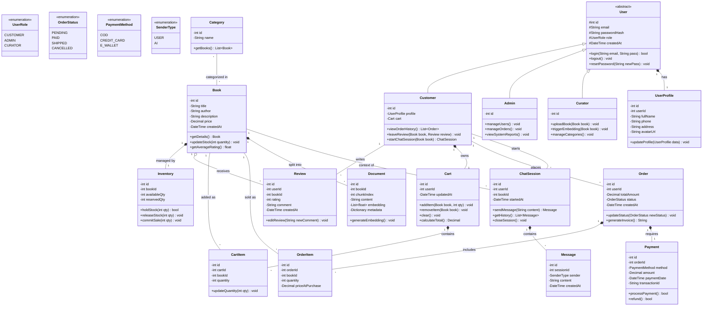

```mermaid
classDiagram
    %% ==========================================
    %% 1. ENUMS
    %% ==========================================
    class UserRole {
        <<enumeration>>
        CUSTOMER
        ADMIN
        CURATOR
    }

    class OrderStatus {
        <<enumeration>>
        PENDING
        PAID
        SHIPPED
        CANCELLED
    }

    class PaymentMethod {
        <<enumeration>>
        COD
        CREDIT_CARD
        E_WALLET
    }

    class SenderType {
        <<enumeration>>
        USER
        AI
    }

    %% ==========================================
    %% 2. USER & AUTHENTICATION (Inheritance)
    %% ==========================================
    class User {
        <<abstract>>
        #int id
        #String email
        #String passwordHash
        #UserRole role
        #DateTime createdAt
        +login(String email, String pass) bool
        +logout() void
        +resetPassword(String newPass) void
    }

    class Customer {
        -int id
        -UserProfile profile
        -Cart cart
        +viewOrderHistory() List~Order~
        +leaveReview(Book book, Review review) void
        +startChatSession(Book book) ChatSession
    }

    class Admin {
        -int id
        +manageUsers() void
        +manageOrders() void
        +viewSystemReports() void
    }

    class Curator {
        -int id
        +uploadBook(Book book) void
        +triggerEmbedding(Book book) void
        +manageCategories() void
    }

    class UserProfile {
        -int id
        -int userId
        -String fullName
        -String phone
        -String address
        -String avatarUrl
        +updateProfile(UserProfile data) void
    }

    User <|-- Customer
    User <|-- Admin
    User <|-- Curator
    User "1" *-- "1" UserProfile : has

    %% ==========================================
    %% 3. E-COMMERCE CORE
    %% ==========================================
    class Category {
        -int id
        -String name
        +getBooks() List~Book~
    }

    class Book {
        -int id
        -String title
        -String author
        -String description
        -Decimal price
        -DateTime createdAt
        +getDetails() Book
        +updateStock(int quantity) void
        +getAverageRating() float
    }

    class Inventory {
        -int id
        -int bookId
        -int availableQty
        -int reservedQty
        +holdStock(int qty) bool
        +releaseStock(int qty) void
        +commitSale(int qty) void
    }

    class Review {
        -int id
        -int userId
        -int bookId
        -int rating
        -String comment
        -DateTime createdAt
        +editReview(String newComment) void
    }

    Category "*" -- "*" Book : categorized in
    Book "1" *-- "1" Inventory : managed by
    Book "1" o-- "*" Review : receives
    Customer "1" -- "*" Review : writes

    %% ==========================================
    %% 4. SALES & ORDERS
    %% ==========================================
    class Cart {
        -int id
        -int userId
        -DateTime updatedAt
        +addItem(Book book, int qty) void
        +removeItem(Book book) void
        +clear() void
        +calculateTotal() Decimal
    }

    class CartItem {
        -int id
        -int cartId
        -int bookId
        -int quantity
        +updateQuantity(int qty) void
    }

    class Order {
        -int id
        -int userId
        -Decimal totalAmount
        -OrderStatus status
        -DateTime createdAt
        +updateStatus(OrderStatus newStatus) void
        +generateInvoice() String
    }

    class OrderItem {
        -int id
        -int orderId
        -int bookId
        -int quantity
        -Decimal priceAtPurchase
    }

    class Payment {
        -int id
        -int orderId
        -PaymentMethod method
        -Decimal amount
        -DateTime paymentDate
        -String transactionId
        +processPayment() bool
        +refund() bool
    }

    Customer "1" *-- "1" Cart : owns
    Cart "1" *-- "*" CartItem : contains
    Customer "1" -- "*" Order : places
    Order "1" *-- "*" OrderItem : includes
    Order "1" *-- "1" Payment : requires
    Book "1" -- "*" CartItem : added as
    Book "1" -- "*" OrderItem : sold as

    %% ==========================================
    %% 5. RAG & INTERACTION MODULE
    %% ==========================================
    class Document {
        -int id
        -int bookId
        -int chunkIndex
        -String content
        -List~float~ embedding
        -Dictionary metadata
        +generateEmbedding() void
    }

    class ChatSession {
        -int id
        -int userId
        -int bookId
        -DateTime startedAt
        +sendMessage(String content) Message
        +getHistory() List~Message~
        +closeSession() void
    }

    class Message {
        -int id
        -int sessionId
        -SenderType sender
        -String content
        -DateTime createdAt
    }

    Book "1" *-- "*" Document : split into
    Customer "1" -- "*" ChatSession : starts
    Book "1" -- "*" ChatSession : context of
    ChatSession "1" *-- "*" Message : contains
```