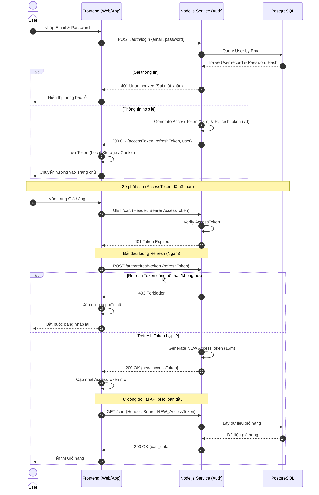
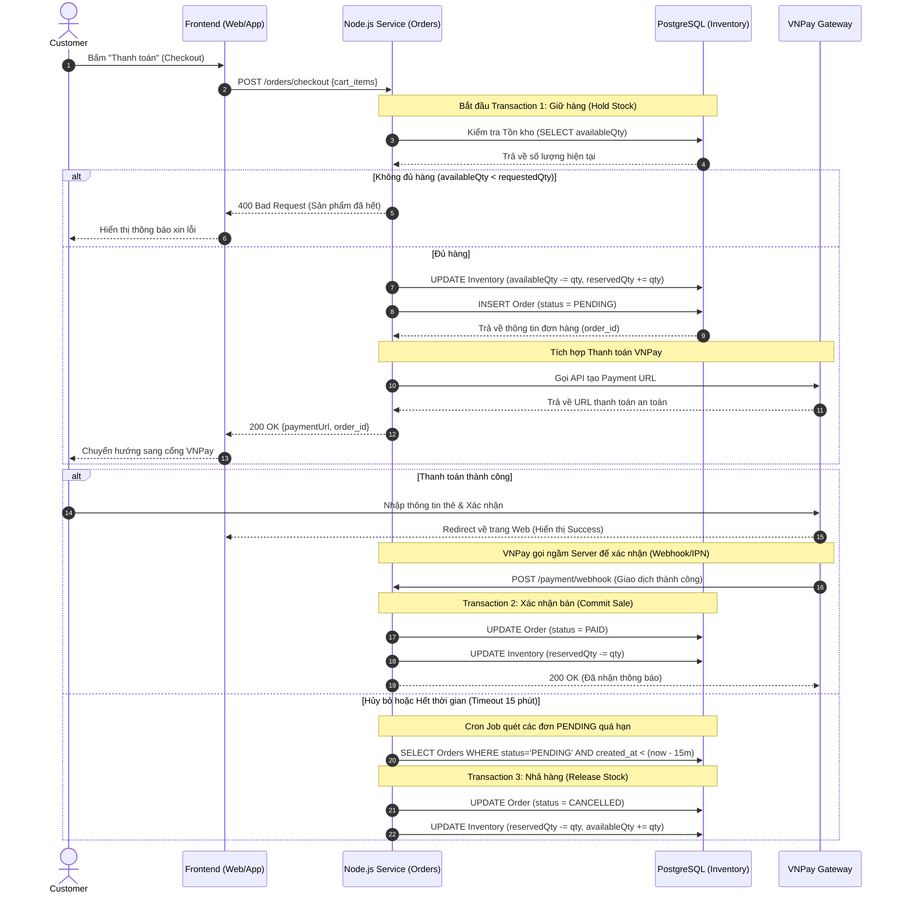
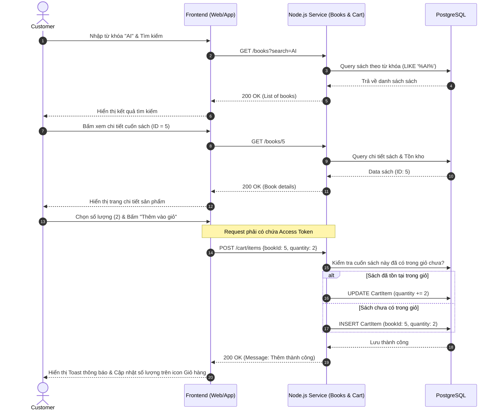
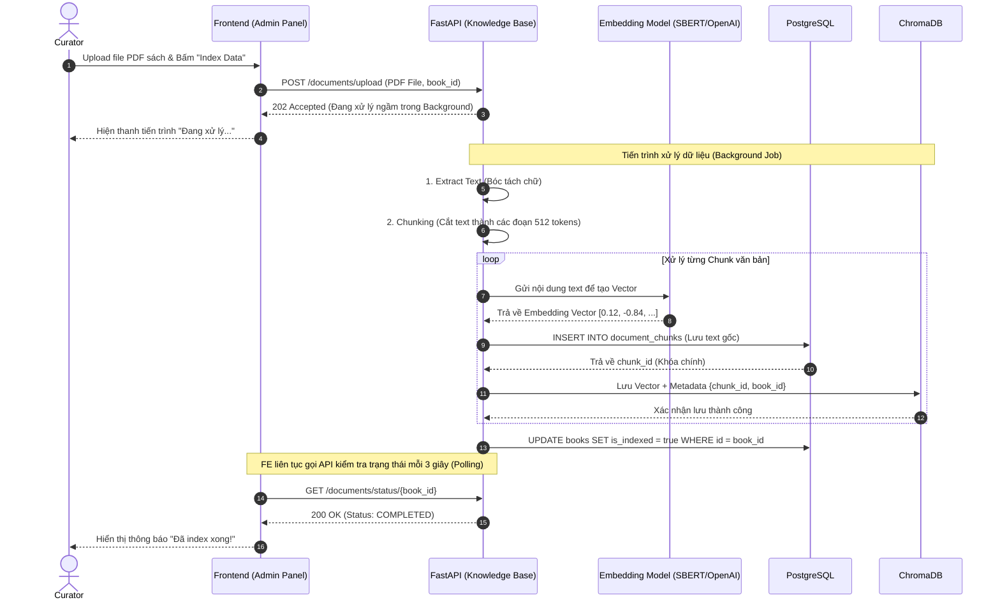
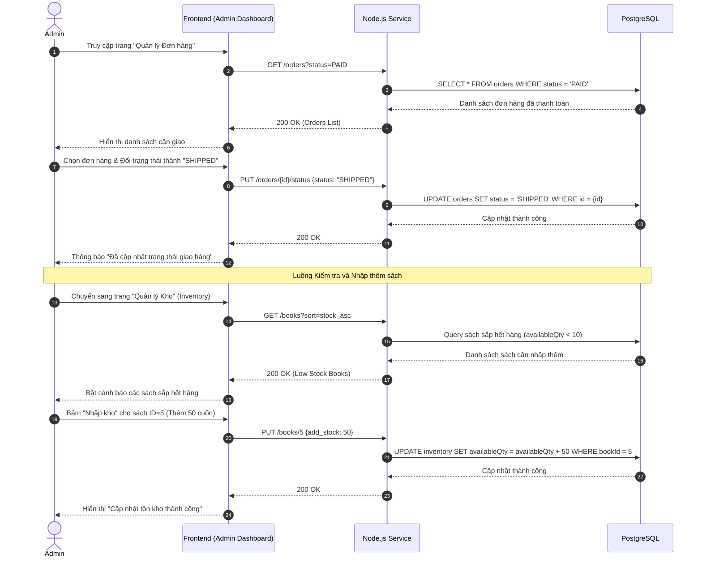

# 🔄 Sơ đồ Trình tự (Sequence Diagrams)

Tài liệu này mô tả chi tiết luồng tương tác giữa các hệ thống (Frontend, Backend Services, Databases) cho các nghiệp vụ cốt lõi của dự án SDL.

## 1. E-commerce Workflows (Task 4.1)

### 1.1. Luồng Xác thực: Đăng nhập & Refresh Token
**Mục đích:** Mô tả cách Frontend lấy Token, lưu trữ và tự động gọi lại API để làm mới Access Token khi bị hết hạn (Mượt mà, không bắt User đăng nhập lại).



### 1.2. Luồng Thanh toán & Xử lý Tồn kho (Checkout & Inventory Hold)
**Mục đích:** Đảm bảo tính toàn vẹn dữ liệu khi đặt hàng. Giữ (Hold) hàng khi user bắt đầu thanh toán để tránh bán vượt mức (Overselling), và tự động nhả (Release) hàng nếu user không thanh toán trong vòng 15 phút.



### 1.3. Luồng Tìm kiếm & Thêm vào Giỏ hàng (Browse & Add to Cart)
**Mục đích:** Mô tả cách người dùng tương tác với hệ thống để tìm kiếm sản phẩm và các bước Backend xử lý khi đưa một cuốn sách vào giỏ hàng.



## 2. RAG AI Workflows (Task 4.2)

### 2.1. Luồng Upload & Trích xuất Dữ liệu Vector (Upload & Embedding)
**Mục đích:** Mô tả quá trình Curator tải một file PDF lên hệ thống. Server sẽ cắt nhỏ tài liệu, biến thành vector và lưu vào ChromaDB. Frontend sử dụng cơ chế Polling để kiểm tra tiến độ.



### 2.2. Luồng Hỏi Đáp AI Tích hợp Tìm kiếm (RAG Chat Query)
**Mục đích:** Mô tả cách Chatbot trả lời câu hỏi của User dựa trên nội dung sách (PDF) đã được xử lý ở bước trên.

sequenceDiagram
    autonumber
    actor User as Customer
    participant FE as Frontend (Chat UI)
    participant RAG as FastAPI (Chat Service)
    participant Embed as Embedding Model
    participant VectorDB as ChromaDB
    participant DB as PostgreSQL
    participant LLM as Large Language Model (OpenAI/Gemini)

    User->>FE: Gửi câu hỏi (VD: "Chương 2 sách này nói gì?")
    FE->>RAG: POST /chat/ask {session_id, book_id, message}
    
    RAG->>DB: Lưu tin nhắn của User vào bảng `messages`
    
    Note over RAG, DB: Bước 1: Query & Retrieval (Tìm kiếm ngữ nghĩa)
    RAG->>Embed: Chuyển câu hỏi của User thành Vector (Query Vector)
    Embed-->>RAG: Trả về mảng Float [0.45, 0.11, ...]
    
    RAG->>VectorDB: Semantic Search (Query Vector, filter: book_id, top_k=3)
    VectorDB-->>RAG: Trả về danh sách Top 3 chunk_id & Điểm tương đồng (Similarity Score)
    
    alt Điểm tương đồng quá thấp (Không có thông tin trong sách)
        RAG->>DB: Lưu tin nhắn AI: "Xin lỗi, sách không đề cập đến vấn đề này"
        RAG-->>FE: 200 OK {answer: "Xin lỗi, sách không...", citations: []}
        FE-->>User: Hiển thị thông báo AI không tìm thấy
    else Điểm tương đồng đạt yêu cầu
        RAG->>DB: SELECT content FROM document_chunks WHERE id IN (Top 3 chunk_id)
        DB-->>RAG: Trả về nội dung text thô của 3 đoạn văn
        
        Note over RAG, LLM: Bước 2: Generation (Sinh câu trả lời)
        RAG->>RAG: Ghép Context (3 đoạn văn) + Câu hỏi User thành System Prompt
        RAG->>LLM: Gửi Prompt yêu cầu trả lời BÁM SÁT vào Context
        LLM-->>RAG: Trả về câu trả lời hoàn chỉnh (Text stream)
        
        RAG->>DB: Lưu tin nhắn của AI vào bảng `messages`
        RAG-->>FE: 200 OK {answer, citations: [Top 3 chunk_id]}
        FE-->>User: Hiển thị câu trả lời AI (kèm trích dẫn nguồn)
    end
```
### 3. Admin Workflows (Task 4.3)

#### 3.1. Luồng Quản lý Tồn kho & Đơn hàng (Manage Inventory & Orders)
**Mục đích:** Mô tả cách Admin kiểm tra các đơn hàng mới, cập nhật trạng thái giao hàng và rà soát, nhập thêm số lượng tồn kho của sách.

